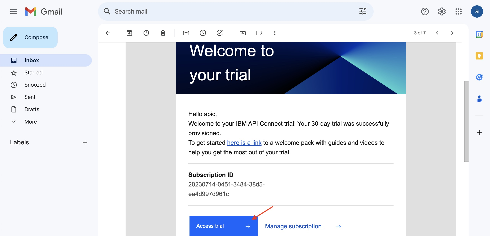
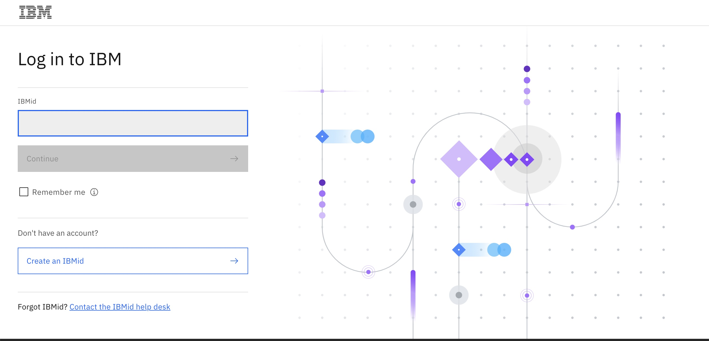
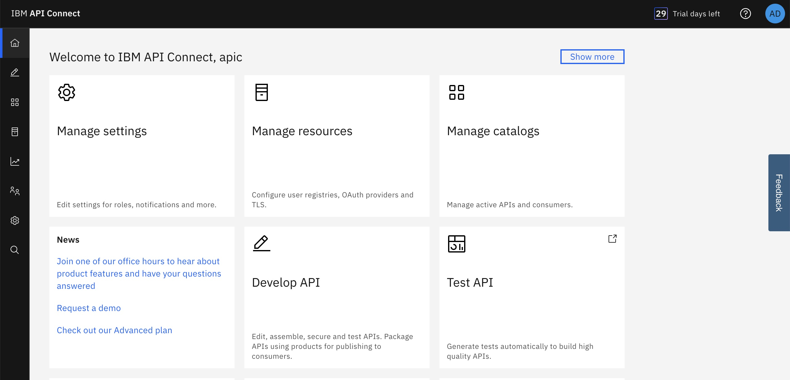
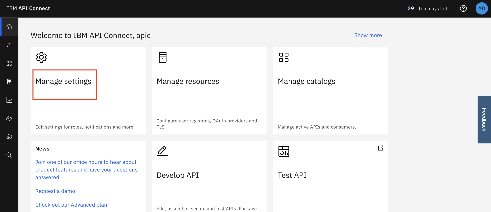
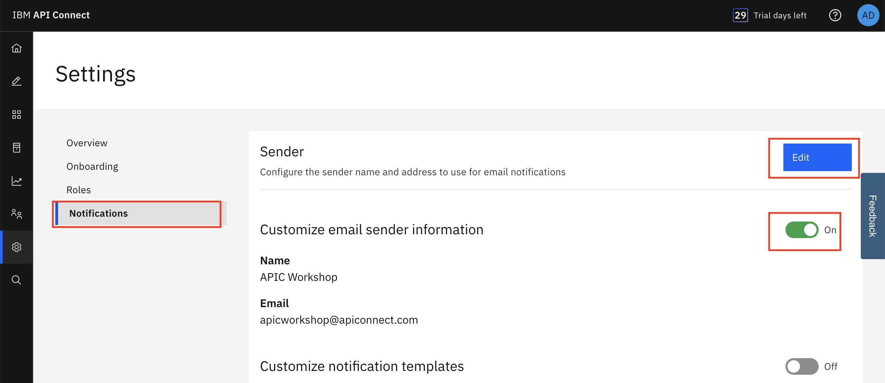
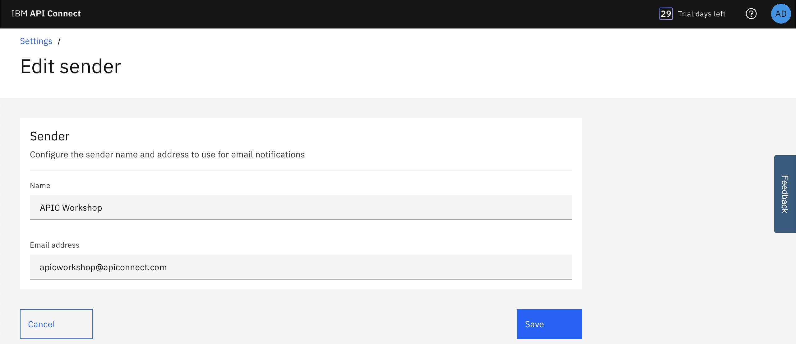

**APIC Workshop Lab 0 - Get Started**

In this lab, you will get started with Lab environment and configure email notifications  

In this tutorial, you will explore the following capabilities:

-   Access the Lab environment. 

-   Access the API Connect.

-   Configure an Email for notifications.
  

 APIC Workshop Series
====================================================================================================================================================================

The APIC Workshop Series is a hands-on workshop with lab exercises that
walk you through designing, publishing, and securing APIs. This workshop
is for API developers, architects, and line of business people who want
to create a successful API strategy. There are 9 labs and each is 30
minutes long. Make sure you choose enough time in your reservation to
get through all the labs! 

[NOTE: ]**[This demo environment using API Connect on AWS. The login
information to the API Connect will be sent in an  email when
you reserve the instance. Use Google Chrome, Firefox or Microsoft Edge
to access the cluster using the credentials supplied. Make sure you
login using Common Services registry.]**

[Lab 0 : Get Started](https://github.com/glenchristian/APICv10-Lab/tree/main/instructions/Lab0)

[Lab 1 : Create and Secure an API to Proxy an Existing REST Web
service](https://github.com/glenchristian/APICv10-Lab/tree/main/instructions/Lab1)

[Lab 2 : The Developer Portal
Experience](https://github.com/glenchristian/APICv10-Lab/tree/main/instructions/Lab2)

[Lab 3 : Add OAuth Security to your
API](https://github.com/glenchristian/APICv10-Lab/tree/main/instructions/Lab3)

[Lab 4 : Use Lifecycle Controls to Version Your
API](https://github.com/glenchristian/APICv10-Lab/tree/main/instructions/Lab4)

 
 Login to API Connect
===========================================================================================

1. Open your email inbox -> search email from API Connect with title
  "Your API Connect trial is ready" -> Click Access Trial

 	
   
2. Login using your IBM Id that was used in the API Connect trial registration

	

3. After login, you will arrived at API Connect main page. Toggle the show more link to hide
   the picture for better viewing
   
	

 Configure sender email address
===========================================================================================

1. From mainpage click Manage Settings 

		

2. Click notifications -> Turn On customization slider -> then click Edit

 		
   
3. Fill the name **APIC Workshop**, email address **apicworkshop@apiconnect.com** then click **Save**

		
    

 Summary
=============================================================

You completed the APIC Workshop Lab 0 - Get Started. 
Throughout the tutorial, you explored the key takeaways:

-   Access the Lab environment.

-   Access the API Connect.

-   Configure an Email for notifications.

Continue the APIC Workshop! Go to [APIC Workshop Lab 1 - Create and Secure an API](https://github.com/glenchristian/APICv10-Lab/tree/main/instructions/Lab1) to
learn how to create and secure a new API using API Connect.
